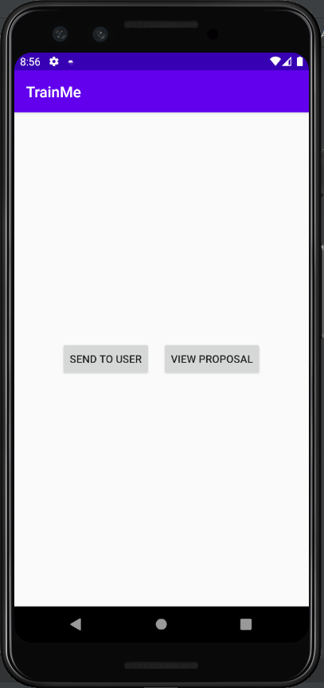
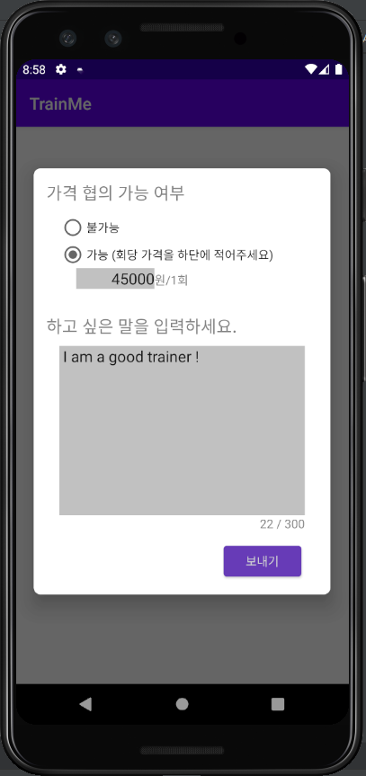
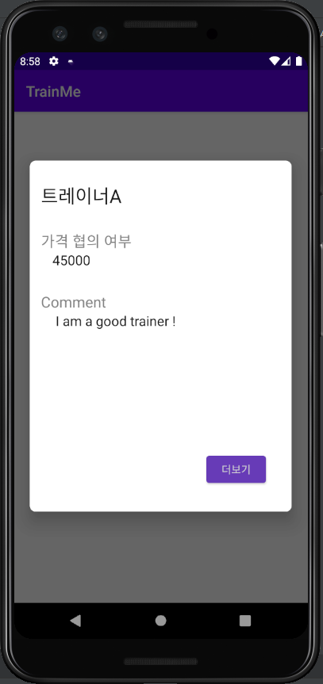
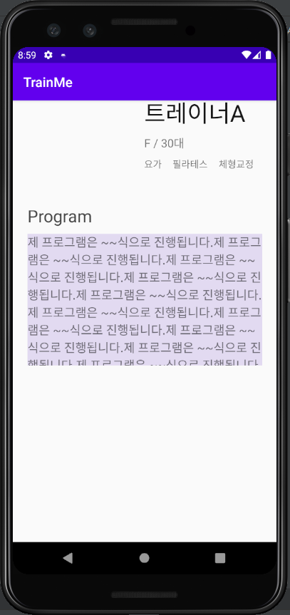

# trainMe_popup
test trainMe pop-up

***
지금 코드에서는 일단 트레이너 아이디는 tid001, 유저 아이디는 id001로 정해놨음.

1. SEND TO USER   
&nbsp;트레이너 고객이 사용하는 기능으로 트레이너가 유저에게 자신의 프로필과 가격 협의 가능 여부, 코멘트를 보내는 부분이다.   
버튼을 누르면 팝업창이 뜨고 칸을 채운 다음에 보내기 버튼을 누른다.   
파이어베이스의 실시간데이터베이스에 저장된다.

2. VIEW PROPOSAL   
&nbsp;유저 고객이 사용하는 기능으로 이 버튼을 누르면 자신에게 제안서를 보낸 트레이너의 가격 협의 가능 여부와 코멘트가 팝업창으로 뜬다.
더 보기 버튼을 누르면 유저에게 제안서를 보낸 트레이너의 정보가 상세 프로필이 뜬다. 

---
## ScreenShot
   
메인 화면

1. 트레이너A가 유저A에게 가격 협의 가능 여부와 코멘트를 채우고   
보내기 버튼을 통해 자신의 프로필을 보낸다.   
(코드 상에서는 유저A의 id를 고정해놨음. 실제로 구현할 때는 이 부분을 리스트뷰를 터치하면 가져오는걸로 바꿔야함.)

2. 유저A의 메인 홈에 트레이너A가 뜬다.

3. 유저A가 트레이너A에게 관심을 보이고 트레이너A 프로필을 누른다.

   
4. 트레이너A가 작성한 가격 협의 가능 여부와 코멘트가 팝업창으로 뜬다.
(코드 상에서는 view proposal을 눌렀을 때는 트레이너A id로 고정. 이 부분도 나중에 리스트뷰를 터치했으면 가져오는 걸로 바꿔야함.)

   
5. 마음에 들지 않으면 뒤로가기를 누르고, 마음에 든다면 더보기를 누르면 트레이너A의 프로필을 볼 수 있다.
